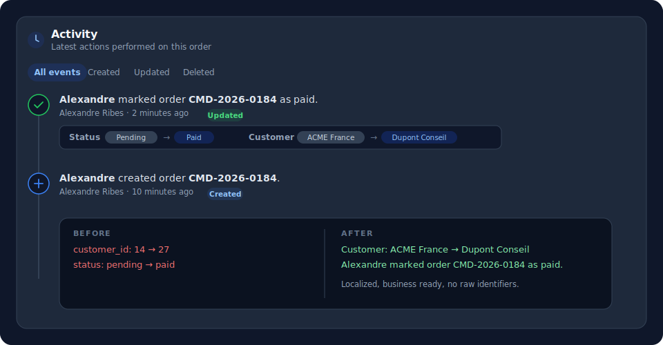

# Filament Activity Timeline

**The semantic activity timeline for Filament.**

> Turn technical activity logs into clear, localized business events.

[](https://packagist.org/packages/laboiteacode/filament-activity-timeline)
[](https://github.com/la-boite-a-code/filament-activity-timeline/actions/workflows/run-tests.yml)
[](https://github.com/la-boite-a-code/filament-activity-timeline/actions/workflows/phpstan.yml)
[](https://packagist.org/packages/laboiteacode/filament-activity-timeline)
[](LICENSE.md)

Stop showing `customer_id: 14 -> 27`. Show `Client: ACME France -> Dupont Conseil`.



## The idea

Several packages already display a timeline of `spatie/laravel-activitylog`
events. This one is different: it is a reusable, localized **presentation layer**
that turns raw model changes into sentences your users actually understand,
without spreading callbacks across every Filament resource.

From a technical activity such as:

```text
App\Models\Order
event: updated
subject_id: 184
properties:
    old.status: pending
    attributes.status: paid
```

it produces, once the presentation is configured:

```text
Alexandre marked order CMD-2026-0184 as paid.
```

And for several changes:

```text
Alexandre updated order CMD-2026-0184
3 changes
- Status: Pending -> Paid
- Payment date: Not set -> 23 July 2026 10:42
- Payment method: Not set -> Credit card
```

## Features

- A ready to use `ActivityTimelineWidget` and a declarative `Timeline` component.
- A `spatie/laravel-activitylog` source, with cursor pagination and server side filters.
- A per model semantic registry: labels, business record titles, icons and colors.
- Human readable formats: text, boolean, date, date time, money, enum, list, json and mapped values.
- Localized null, empty and boolean values.
- Sensitive attributes hidden, redacted or masked by default.
- Relation identifiers resolved to titles, with no N+1 queries.
- Optional subject and relation snapshots, so titles survive deletion.
- Translatable business sentences per event, and custom events.
- English and French translations out of the box.
- Native Filament look, default colors, light and dark themes, responsive and accessible.

## Requirements

- PHP 8.3, 8.4 or 8.5
- Laravel 12 or 13
- Filament 4 or 5
- `spatie/laravel-activitylog` 5 (only when using the Spatie source)

## Installation

```bash
composer require laboiteacode/filament-activity-timeline
```

When you use the Spatie integration:

```bash
composer require spatie/laravel-activitylog

php artisan vendor:publish \
    --provider="Spatie\Activitylog\ActivitylogServiceProvider" \
    --tag="activitylog-migrations"

php artisan migrate
```

Optionally publish the configuration and the translations:

```bash
php artisan vendor:publish --tag="filament-activity-timeline-config"
php artisan vendor:publish --tag="filament-activity-timeline-translations"
```

## Registering the plugin

```php
use LaBoiteACode\FilamentActivityTimeline\FilamentActivityTimelinePlugin;

public function panel(Panel $panel): Panel
{
    return $panel->plugins([
        FilamentActivityTimelinePlugin::make(),
    ]);
}
```

The plugin works with sensible defaults and no further configuration.

## Quick start

This package does not record activity; it presents activity recorded by another
system. With `spatie/laravel-activitylog`, make your model log its changes, then
show the timeline.

1. Log activity on the model (see the Spatie documentation for all options):

```php
use Illuminate\Database\Eloquent\Model;
use Spatie\Activitylog\Models\Concerns\LogsActivity;
use Spatie\Activitylog\Support\LogOptions;

class Order extends Model
{
    use LogsActivity;

    public function getActivitylogOptions(): LogOptions
    {
        return LogOptions::defaults()
            ->logOnly(['status', 'total', 'customer_id', 'paid_at'])
            ->logOnlyDirty();
    }
}
```

2. Show the timeline on the record's view page with the widget or the infolist
   entry (see [Basic usage](#basic-usage)).

That already gives a working timeline. Everything after that is about turning
those technical logs into clear, localized business sentences.

## Basic usage

### As a widget

Extend the widget to configure it, then register it on a resource record page.
On a record page Filament injects the current record into the widget's `$record`
property automatically.

```php
use App\Models\Order;
use LaBoiteACode\FilamentActivityTimeline\Timeline;
use LaBoiteACode\FilamentActivityTimeline\Widgets\ActivityTimelineWidget;

class OrderTimelineWidget extends ActivityTimelineWidget
{
    protected function timeline(): Timeline
    {
        return Timeline::make()
            ->source('spatie')
            ->limit(15)
            ->loadMore()
            ->filters();
    }
}
```

```php
// App\Filament\Resources\Orders\Pages\ViewOrder
protected function getFooterWidgets(): array
{
    return [
        OrderTimelineWidget::class,
    ];
}
```

You can also drop the widget in with plain, serializable properties and let the
global registry provide the presentation:

```blade
@livewire(\LaBoiteACode\FilamentActivityTimeline\Widgets\ActivityTimelineWidget::class, [
    'record' => $record,
    'source' => 'spatie',
    'withLoadMore' => true,
    'withFilters' => true,
])
```

### In a page

```php
use LaBoiteACode\FilamentActivityTimeline\Timeline;

Timeline::make('activity')
    ->record($this->record)
    ->loadMore()
    ->filters();
```

When rendered in a page, only serializable configuration crosses the Livewire
boundary, so declare closures on a widget subclass or in the global registry.

### In an infolist

Place the timeline in a resource infolist or any schema with
`ActivityTimelineEntry`. The record is provided by the infolist automatically.

```php
use LaBoiteACode\FilamentActivityTimeline\Infolists\ActivityTimelineEntry;

public function infolist(Schema $schema): Schema // Infolist $infolist on Filament 4
{
    return $schema->components([
        TextEntry::make('number'),
        // ...
        ActivityTimelineEntry::make('activity')
            ->source('spatie')
            ->heading('History')
            ->loadMore()
            ->filters(),
    ]);
}
```

By default the entry is interactive: it embeds the timeline widget, so "load
more" and the filters work inside the infolist. Call `->static()` for a read
only, non interactive list (useful for print or a frozen infolist):

```php
ActivityTimelineEntry::make('activity')
    ->source('spatie')
    ->static();
```

## Using the semantic registry

Declare a model presentation once, usually in a service provider. Every timeline
that shows that model then benefits from it.

```php
use App\Enums\OrderStatus;
use App\Filament\Resources\Orders\OrderResource;
use App\Models\Order;
use LaBoiteACode\FilamentActivityTimeline\ActivityTimeline;
use LaBoiteACode\FilamentActivityTimeline\Presentation\AttributePresentation;

ActivityTimeline::forModel(Order::class)
    ->resource(OrderResource::class)
    ->label('order')
    ->pluralLabel('orders')
    ->recordTitleUsing(fn (Order $order) => $order->number)
    ->icon('heroicon-o-shopping-cart')
    ->color('primary')
    ->attributes([
        'status' => AttributePresentation::make('Status')
            ->enum(OrderStatus::class),

        'customer_id' => AttributePresentation::make('Customer')
            ->relationship('customer', titleAttribute: 'name'),

        'total' => AttributePresentation::make('Total')
            ->money('EUR'),

        'paid_at' => AttributePresentation::make('Payment date')
            ->dateTime(),

        'internal_token' => AttributePresentation::make()
            ->hidden(),
    ])
    ->eventSentence('created', ':causer created :subject.')
    ->eventSentence('updated', ':causer updated :subject.')
    ->eventSentence('deleted', ':causer deleted :subject.');
```

A model may also expose its own presentation:

```php
use LaBoiteACode\FilamentActivityTimeline\Contracts\HasActivityTimelinePresentation;
use LaBoiteACode\FilamentActivityTimeline\Presentation\ModelPresentation;

class Order extends Model implements HasActivityTimelinePresentation
{
    public static function activityTimelinePresentation(): ModelPresentation
    {
        return ModelPresentation::make()
            ->label('order')
            ->recordTitleUsing(fn (Order $order): string => $order->number);
    }
}
```

Resolution priority, highest first: local timeline overrides, the global
registry, the model contract, the Filament resource, then conventions.

## Customizing events

Register a presentation for any event, custom or not:

```php
use LaBoiteACode\FilamentActivityTimeline\ActivityTimeline;

ActivityTimeline::event('invoice.sent')
    ->label('Invoice sent')
    ->sentence(':causer sent :subject to :property.recipient_email.')
    ->icon('heroicon-o-paper-airplane')
    ->color('info');
```

Override an event locally on a timeline, or use a callback for full control:

```php
use LaBoiteACode\FilamentActivityTimeline\Support\PresentationContext;
use LaBoiteACode\FilamentActivityTimeline\Data\TimelineEntry;

Timeline::make()
    ->eventSentence('updated', ':causer actualized :subject.')
    ->eventSentenceUsing(
        'status_changed',
        fn (TimelineEntry $entry, PresentationContext $context): string =>
            "{$context->causerName()} marked {$context->subject()} as {$context->newValue('status')}.",
    );
```

Available sentence variables: `:causer`, `:subject`, `:subject_label`,
`:subject_title`, `:event`, `:changes_count`, `:date` and `:property.path`.

## Customizing the causer

```php
Timeline::make()
    ->causerNameUsing(fn (?Model $causer) => $causer?->name)
    ->causerAvatarUsing(fn (?Model $causer) => $causer?->avatar_url);
```

When an activity has no causer, a configurable system identity is shown.

## Displaying changes

For `updated` events, the old and new values are rendered readably. By default:

- sensitive attributes are hidden;
- column names are humanized;
- null, empty and boolean values are localized;
- long strings are truncated;
- relation identifiers are resolved to titles.

```php
Timeline::make()
    ->hiddenAttributes(['password', 'remember_token'])
    ->attributeLabels(['email_verified_at' => 'Email verification'])
    ->formatAttributeUsing('status', fn (mixed $value) => OrderStatus::tryFrom($value)?->getLabel() ?? $value);
```

Per attribute helpers:

```php
use LaBoiteACode\FilamentActivityTimeline\Presentation\AttributePresentation;

AttributePresentation::make('Active')->boolean();
AttributePresentation::make('Amount')->money('EUR');
AttributePresentation::make('Published at')->dateTime();
AttributePresentation::make('Status')->enum(OrderStatus::class);
AttributePresentation::make('Tags')->list();
AttributePresentation::make('Metadata')->json();
AttributePresentation::make('Customer')->relationship('customer', titleAttribute: 'name');
AttributePresentation::make('API key')->redacted();
AttributePresentation::make('Email')->maskUsing(fn (string $value) => Str::mask($value, '*', 3, -10));
```

### Snapshots

To keep a relation or subject title readable after the related record is
deleted, store a snapshot in the activity properties at log time:

```php
'presentation' => [
    'subject_label' => 'order',
    'subject_title' => 'CMD-2026-0184',
    'attributes' => [
        'customer_id' => ['old_label' => 'ACME France', 'new_label' => 'Dupont Conseil'],
    ],
]
```

Snapshots always win over a live lookup.

### Diagnosing the presentation

When you are not sure how a label, a record title or a format was resolved,
enable the diagnostic output. Keep it off in production.

```php
Timeline::make()->debugPresentation();
```

## Filters

Server side filters by event are enabled with `->filters()`. A native Filament
tab bar lets the user switch between all events and each known event.

## Pagination

Set the page size with `->limit()` and enable progressive loading with
`->loadMore()`. The "load more" button is disabled while loading, disappears
when there is nothing left, keeps the already loaded items and never duplicates
an entry.

## Translations

English and French ship with the package. Publish and edit them, or add your own
locale, with the `filament-activity-timeline-translations` tag. Visible labels
are resolved from the translation files, so the published configuration stays
free of hard coded strings.

## Configuration

Publish `config/filament-activity-timeline.php` to change the defaults:

- `default_source`: the source used when a timeline does not pick one.
- `pagination.per_page` and `pagination.mode` (`load_more` or `simple`).
- `date_format` and `timezone` for the absolute date shown on hover.
- `system_causer`: the identity shown when an activity has no causer.
- `events`: the icon and color for each known event.
- `hidden_attributes`: attribute names that are never shown in a change list.
- `attributes.truncate`: the maximum length of a rendered string value.
- `relations.resolve`: resolve relation identifiers to titles.

Visible labels are read from the translation files, not from this config, so the
published file stays free of hard coded strings.

## Adding a source

The Spatie source is registered as `spatie` by default. Register another source
(a custom table, an external API, another package) by name in a service
provider:

```php
use LaBoiteACode\FilamentActivityTimeline\ActivityTimeline;

ActivityTimeline::registerSource('audit', fn () => new AuditSource());
```

A source implements
`LaBoiteACode\FilamentActivityTimeline\Contracts\ActivitySource` and returns
normalized `TimelineEntry` objects, so the presentation layer never depends on a
specific logging library. Select it with `->source('audit')`.

## Testing

```bash
composer test
```

The suite runs against Filament 4 and 5, Livewire 3 and 4, Laravel 12 and 13,
and PHP 8.3 to 8.5.

## Contributing

Please see [CONTRIBUTING.md](CONTRIBUTING.md) for details.

## Security

Please see [SECURITY.md](SECURITY.md) for reporting vulnerabilities.

## Credits

- [La Boite A Code](https://github.com/la-boite-a-code)

## License

The MIT License (MIT). Please see [LICENSE.md](LICENSE.md) for more information.
